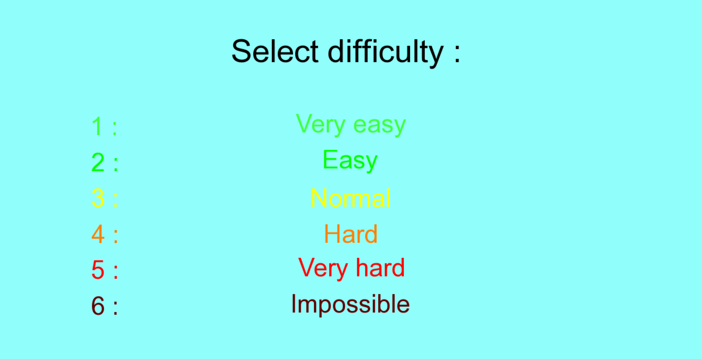
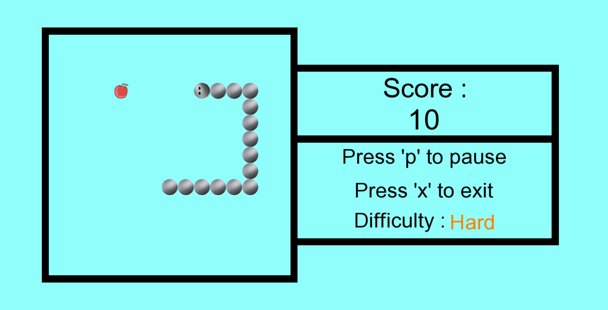

# Snake
Here is a snake game I made using a free C++ library named SFML, which allows us to draw things into the screen in order to create video games for example. You can find more informations about SFML here : https://www.sfml-dev.org/.

The commands for playing are very simple:
- Z,Q,S,D to move the Snake
- P to pause the game
- X to quit the game

The SFML files are not provided with the github. However, you can install them and integrate them to your solution. If you use Visual Studio, you can simply follow this tutorial: https://www.youtube.com/watch?v=axIgxBQVBg0&list=PL21OsoBLPpMOO6zyVlxZ4S4hwkY_SLRW9&ab_channel=HilzeVonck.

If you see any bug, please don't hesitate to tell me :)

## Screenshots

Main menu

In game image

